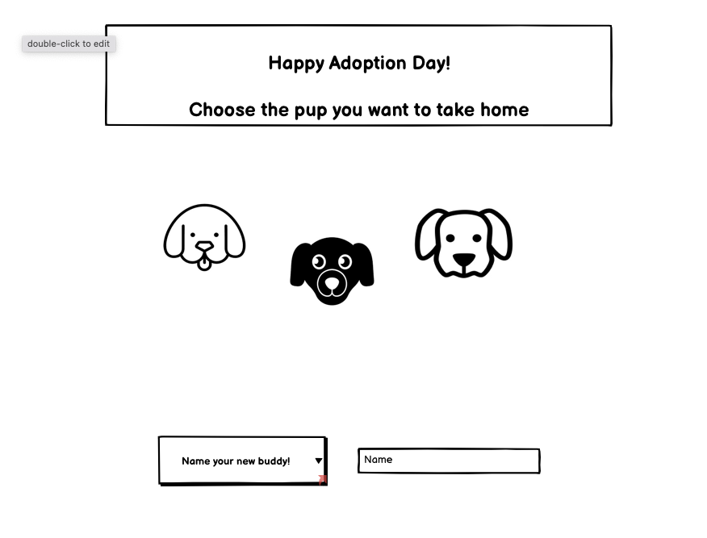
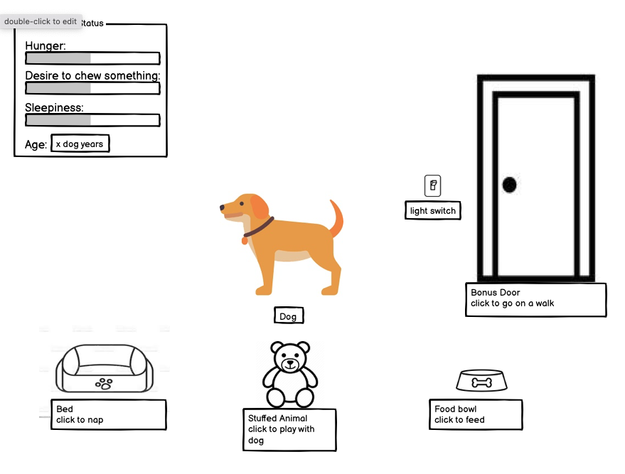
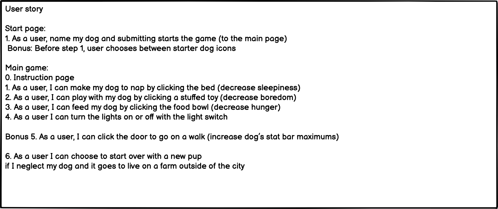

# Tamagotchi-Project
A little browser game for a Tamagotchi-like interaction to keep a creature alive, as time passes and status bars change.
Made for the first project for GA class.
I choose to make mine a little dog that you adopt and take care of, or try to, at least.

wireframes

user story

User story

Start page:
1. As a user, name my dog and submitting starts the game (to the main page)
 Bonus: Before step 1, user chooses between starter dog icons

Main game:
0. Instruction page
1. As a user, I can make my dog to nap by clicking the bed (decrease sleepiness)
2. As a user, I can play with my dog by clicking a stuffed toy (decrease boredom)
3. As a user, I can feed my dog by clicking the food bowl (decrease hunger)
4. As a user I can turn the lights on or off with the light switch

Bonus 5. As a user, I can click the door to go on a walk (increase dog’s stat bar maximums)

6. As a user I can choose to start over with a new pup 
if I neglect my dog or it ages out and it goes to live on a farm outside of the city

I spent a lot of time on the CSS, originally planning multiple pages and then condensing to one page with many layers for simplicity and ease.

User stats by filling out a form to name the dog name, submitting the name removes that start layer.

Next the user is shown a little instruction page, and must click to confirm they understand the instructions.

Confirming instructions removes that layer, and starts the main game.

The dog class creats a dog object, with the functions to reduce it's stats bars and evolve twice with time in it's methods.

The main function is just multiple if statments, in which the dog's age, hunger, boredom, and sleepiness increase with time if non of the game ending conditions have been met, and that is called by a setinterval function.

In the current state the interval is set to 3 seconds, so every three seconds a (dog) year passes and each stat bar increases by one.

Clicking any of the interact buttons reduces that stat by 3 bars, or down to zero. The dog can live to a healthy 120 dog years (17 human years) if the proper care is taken.

The light switch (and the bed interaction) will bring down another overlay with a dark semi-opaque layer to simulate lights out.

And when any game ending conditions are met, whether a stat bar makes it to 10, or the dog hits maximum age, the main game layer disappears, and the user sees the end game text depending on what lead them there.

On the end game page the user has the option to try again, which is just a hard reload of the page, putting all the layers back down on the page and making it ready to start again.

// image sources 
cartoon-living-room - https://www.postermywall.com/index.php/art/template/22462e434b37f844c14ba6a9381c71fe/cartoon-living-room-tv-set-design-template

Puppy and dog pictures 
by Xinh Studio
https://thenounproject.com/xinhstudio/collection/joijoi-the-vegetarian-puppy/

Bowl 
by Juraj Sedlák
https://thenounproject.com/search/?q=dog+bowl&i=554796

Dog Toys 
by Imogen Oh
https://thenounproject.com/search/?q=dog+toy&i=487566

Dog Bed 
by Cynthia Navarro
https://thenounproject.com/search/?q=dog+bed&i=4188139

Light switch 
by Sara Jeffries
https://thenounproject.com/search/?q=light+switch&i=92359

Door 
by joeartcon
https://thenounproject.com/search/?q=door&i=894906

Farm 
by The Icon Z
https://thenounproject.com/search/?q=farm&i=4375644

Warning 
by DewDrops
https://thenounproject.com/search/?q=warning&i=936842